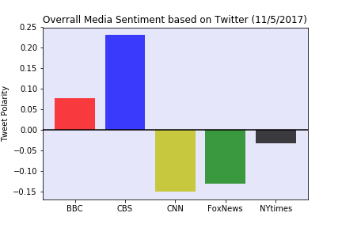
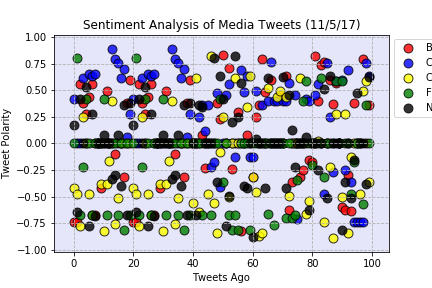

# Assignment - Distinguishing Sentiments
## News Mood

From the sentiment analysis results with the five media tweets on November 5,2017, we can note that:
 
1. On November 5, 2017, overall sentiment polarity is positive for BBC and CBS tweets and negative for Fox News and CNN. For NY Times, the tweet sentiment is almost neutral. 

2. From the overall media sentiment based on tweets, CBS is most positive at 23% and BBC is the second most positive with 7.7%.

3. The results also show that CNN is most negative with 14.9 % negative polarity and Fox News is second with 13%.

4. NY Times has 3.1% negative polarity, which the closest to neutral.

